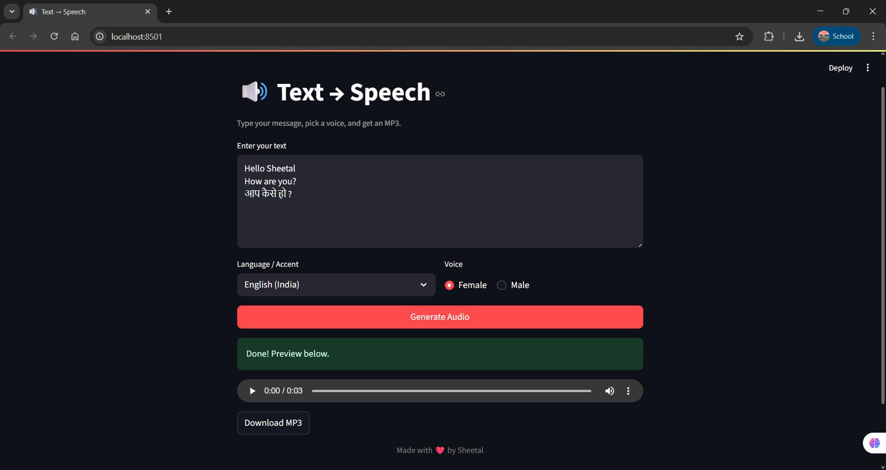

# 🔊 Text → Speech (Streamlit + Edge TTS)

A simple **Text-to-Speech (TTS) web app** built using [Streamlit](https://streamlit.io/) and [Edge TTS](https://github.com/rany2/edge-tts).  
This app lets you **type text, choose a voice (Male/Female), select language/accent**, and generate an **MP3 audio file** instantly.  

---

## 🚀 Features
- 📝 Enter custom text (supports **English & Hindi**).
- 🎙️ Choose between **Male / Female voices**.
- 🌍 Supports **English (India), English (US), Hindi**.
- 🎧 Listen to generated audio directly on the app.
- 💾 Download the output as an **MP3 file**.
- 🎨 Clean & modern UI with Streamlit.

---

## 📸 Demo Screenshot



---

## ⚙️ Installation & Setup

1. Clone the repository:
   ```bash
   git clone https://github.com/your-username/text-to-speech-app.git
   cd text-to-speech-app
   ```

2. Create a virtual environment (optional but recommended):
   ```bash
   python -m venv venv
   source venv/bin/activate   # On Linux/Mac
   venv\Scripts\activate      # On Windows
   ```

3. Install dependencies:
   ```bash
   pip install -r requirements.txt
   ```

4. Run the app:
   ```bash
   streamlit run app.py
   ```

---

## 📦 Requirements
- Python 3.8+
- streamlit
- edge-tts
- asyncio

(You can install all with `pip install -r requirements.txt`)

---

## 🎯 Usage
- Open the app in your browser (`http://localhost:8501`).
- Type your message in the text area.
- Select **language, accent, and voice**.
- Click **Generate Audio** to preview & download your MP3.

---

## ❤️ Credits
Made with ❤️ by **Sheetal**
